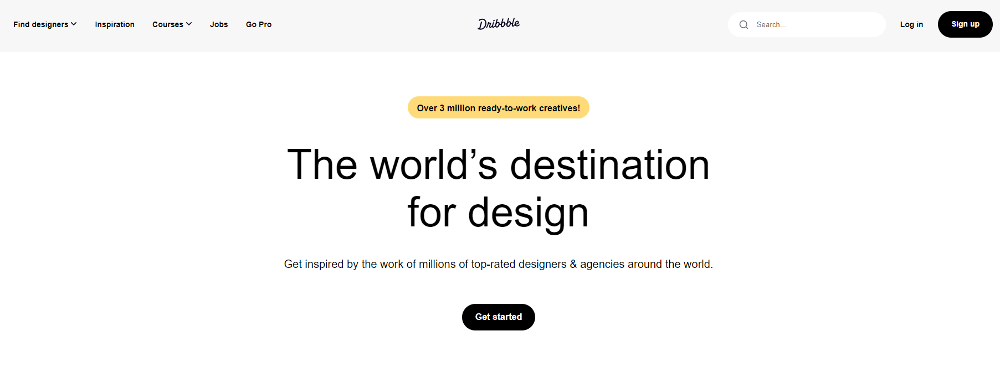

# Replicando la Página Principal de Dribbble

Este proyecto es una réplica de la página principal de Dribbble utilizando solo HTML y CSS. El objetivo es mostrar mis conocimientos en desarrollo front-end y el uso de GitHub Pages para lanzar y compartir el proyecto.

## Visita el Sitio Web

Puedes ver el proyecto en vivo en [GitHub Pages](https://kharlz01.github.io/DribblePage/).

## Descripción del Proyecto

Este proyecto recrea la página principal de Dribbble, una plataforma popular para diseñadores gráficos, ilustradores y otros creativos.

## Capturas de Pantalla

## Tecnologías Utilizadas

- **HTML5**: Para la estructura del contenido.
- **CSS3**: Para el diseño y el estilo visual.
  - Flexbox: Utilizado para la disposición de elementos.
  - Grid: Utilizado para la disposición de la galería de trabajos.
  - Media Queries: Para un diseño responsivo que se adapta a diferentes tamaños de pantalla.

## Instalación y Uso

1. **Clona el repositorio**:

`git clone https://github.com/Kharlz01/DribblePage.git`

2. **Navega al directorio del proyecto**:

`cd DribbblePage`

3. Abre `index.html` en tu navegador para ver el proyecto.

## Desarrollo

Este proyecto se desarrolló utilizando técnicas modernas de HTML y CSS, prestando especial atención a la semántica y accesibilidad del código. A continuación se detallan algunas de las prácticas utilizadas:

- HTML Semántico: Uso de etiquetas como <header>, <nav>, <section>, <article>, y <footer> para una estructura clara y comprensible.
- Flexbox y Grid: Para una disposición de elementos flexible y eficiente.
- Diseño Responsivo: Utilización de media queries para asegurar que el sitio se vea bien en dispositivos móviles, tabletas y escritorios.
- Variables CSS: Definición de variables para colores y fuentes para una fácil personalización y mantenimiento del código.

## Contribución

Si deseas contribuir a este proyecto:

1. Haz un fork del repositorio.
2. Crea una rama para tu característica (git checkout -b feature/nueva-caracteristica).
3. Realiza tus cambios y haz commit (git commit -m 'Agregar nueva característica').
4. Sube tus cambios (git push origin feature/nueva-caracteristica).
5. Abre un Pull Request.

## Licencia

Este proyecto está licenciado bajo la Licencia MIT. Para más detalles, consulta el archivo LICENSE.

## Contacto

Si tienes alguna pregunta o sugerencia, no dudes en contactarme a través de mi cuenta de GitHub.

¡Gracias por visitar y disfrutar del proyecto!